# Data Visualization with Power BI + Cloud — Proyecto Final

  

## 📝 Descripción del Proyecto
Este repositorio contiene el desarrollo del proyecto final para el curso **Data Visualization with Power BI + Cloud (2026)**. En esta etapa, el proyecto ha evolucionado hacia una solución integral de Inteligencia de Negocios implementada en **Microsoft Power BI**, enfocada en la toma de decisiones estratégicas basadas en datos.

El proyecto abarca desde la concepción del caso de negocio hasta la resolución de 10 preguntas clave de asesoría mediante visualizaciones dinámicas y narración de datos.

---

## 🎯 Objetivo del Proyecto
Analizar y optimizar el porcentaje de kilogramos exportables por campaña en una empresa agroexportadora de arándanos. A través del análisis de datos, la selección de indicadores clave (KPIs) y el diseño de dashboards interactivos, se busca **incrementar en un 10% el KPI de exportabilidad** y mejorar la rentabilidad del negocio, segmentando el comportamiento por regiones y variedades.

### 💼 Caso de Negocio

*   **El Problema:** Al cierre de la campaña anual 25-26 (01 de mayo de 2026), el valor del *Indicador Anual de Arándanos Exportables por Campaña* de la empresa **BerryData** se situó en un **75%**, ubicándose en un nivel de eficiencia bajo (semáforo rojo). Esto representa una pérdida notable de fruta que podría colocarse en mercados internacionales de mayor valor.
*   **La Meta:** Incrementar este indicador al **85%** al cierre de la campaña 26-27 (01 de mayo de 2027), alcanzando el nivel óptimo de eficiencia (semáforo verde) y maximizando el volumen de exportación.
*   **La Estrategia:** Implementar un plan de mejora enfocado en el proceso de postcosecha que incluye:
    *   Capacitación al personal en selección y clasificación de fruta.
    *   Estandarización de criterios de calidad exportable.
    *   Optimización del manejo, cadena de frío y conservación del arándano.
    *   Seguimiento operativo constante mediante indicadores de calidad.
*   **Costo / Beneficio:** 
    *   *Costo único total de implementación:* S/ 20,000 (Soles por campaña anual).
    *   *Facturación adicional estimada:* S/ 70,000 (Soles por campaña anual al cumplir el objetivo).
    *   *Retorno Neto Estimado (ROI):* S/ 50,000 (Soles de beneficio directo).

---

## 📊 Estructura del Reporte en Power BI
El informe está estructurado en pestañas estratégicas para guiar al usuario a través del dato:

*   **Caso de Negocio:** Contexto, problemática y justificación financiera del proyecto.
*   **Indicadores:** Definición de las métricas clave y KPIs de rendimiento.
*   **Dashboard:** Panel principal interactivo con la situación macro de la operación.
*   **Reporte Detallado:** Evolución histórica del KPI de exportabilidad y diagnóstico con metodología WHAT / SO WHAT / NOW WHAT.
*   **Sección de Asesoría (Preguntas 1 a 10):** Respuestas analíticas a los 10 requerimientos críticos planteados en la asesoría del negocio.
*   **Script de Datos (Query SQL):** Consulta de carga y poblamiento de la base de datos origen.
---

## 🗄️ Modelo de Datos
El proyecto cuenta con un modelo relacional diseñado para analizar el rendimiento de la fruta desde las etapas de cultivo hasta su clasificación final en las líneas de empaque. 

  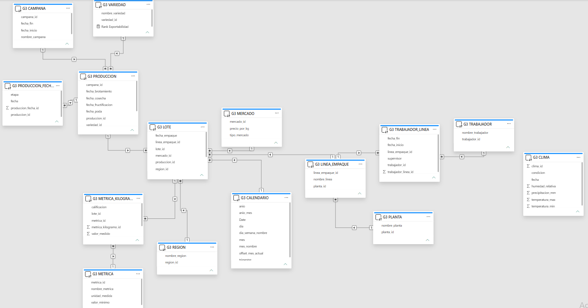

### 📐 Arquitectura del Modelo
El diseño combina tablas de hechos centrales asociadas a dimensiones de negocio organizadas para optimizar las consultas analíticas:

*   **Núcleo de Operaciones y Calidad:** La tabla `G3 LOTE` funciona como nexo principal, conectando el origen agrícola (`G3 PRODUCCION`) con los resultados de inspección (`G3 METRICA_KILOGRAMO`).
*   **Gestión de Producción y Variedades:** Vincula el lote con las tablas `G3 CAMPAÑA` y `G3 VARIEDAD` para evaluar el rendimiento genético e histórico por temporada.
*   **Dimensión Temporal y Geográfica:** Mapeo continuo a través de `G3 CALENDARIO` y segmentación espacial mediante `G3 REGION` para identificar oportunidades geográficas.
*   **Control de Planta y Personal:** Relación detallada entre `G3 LINEA_EMPAQUE`, `G3 PLANTA` y la asignación operativa de supervisores y operarios a través de `G3 TRABAJADOR_LINEA` y `G3 TRABAJADOR`.

---

### 📜 Carga y Preparación de Datos (SQL Query)
Para el proceso de extracción, transformación e inserción de la información origen en el modelo relacional, se diseñó una consulta SQL optimizada.

*   **Ubicación de la Query:** [`sql/SQLQuery-grupo 3.sql`](./sql/SQLQuery-grupo 3.sql)

---

## 📊 Estructura Analítica del Reporte

### 1. Indicadores (Ficha Técnica del KPI)
Esta sección define las reglas operativas y comerciales bajo las cuales **Berry-Data** evalúa el éxito de sus campañas. El estado de la fruta depende de tres parámetros físicos controlados por el área de calidad:

*   **Firmeza:** Debe ser mayor a $200\text{ g/mm}$.
*   **Calibre:** Debe ser mayor a $18\text{ mm}$.
*   **Grados Brix (Dulzura):** Debe ser superior a $10^\circ$.

> El incumplimiento de cualquiera de estas métricas clasifica automáticamente a la fruta como **No Exportable**, siendo desviada al mercado nacional.

*   **Fórmula del KPI:**
$$\text{\% Arándanos Exportables} = \left( \frac{\text{Kg. Totales Exportables (Campaña Anual)}}{\text{Kg. Totales Producidos (Campaña Anual)}} \right) \times 100$$

*   **Rangos de Gestión (Semáforo operativo):**
    *   🟢 **Umbral Óptimo:** $\ge 85\%$
    *   🟡 **Zona de Alerta:** $> 75\%$ a $< 85\%$
    *   🔴 **Estado Crítico:** $\le 75\%$

*   **Impacto Económico:** Un kilogramo de arándano exportable alcanza un valor de mercado de **S/ 12**, frente a los **S/ 5** del mercado nacional. Tomando como base una producción anual promedio de **100,000 kg**, cada incremento de **1%** en la exportabilidad representa **S/ 7,000** adicionales en la facturación anual, haciendo que este indicador sea crítico para la sostenibilidad del negocio.

  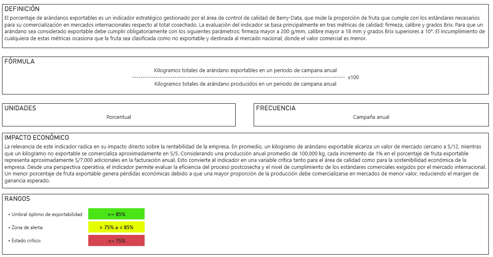

---

### 2. Dashboard Principal (Vistas por Campaña)
El panel principal interactivo permite realizar un seguimiento macro de la operación. Para reflejar la evolución histórica y el comportamiento del negocio, se documentan las vistas dinámicas según la campaña seleccionada:

#### 📅 Campaña 2022-2023
Línea de base histórica con los volúmenes iniciales procesados por la empresa.

  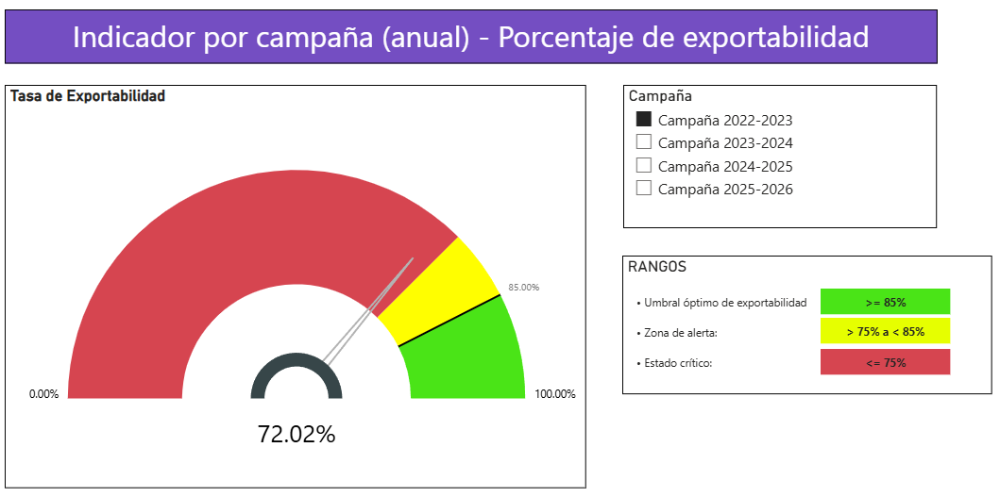

---

#### 📅 Campaña 2023-2024
Comportamiento intermedio de la producción y seguimiento de indicadores de calidad.

  

---

#### 📅 Campaña 2024-2025
Tendencia previa y consolidación de datos de exportabilidad por zona.

  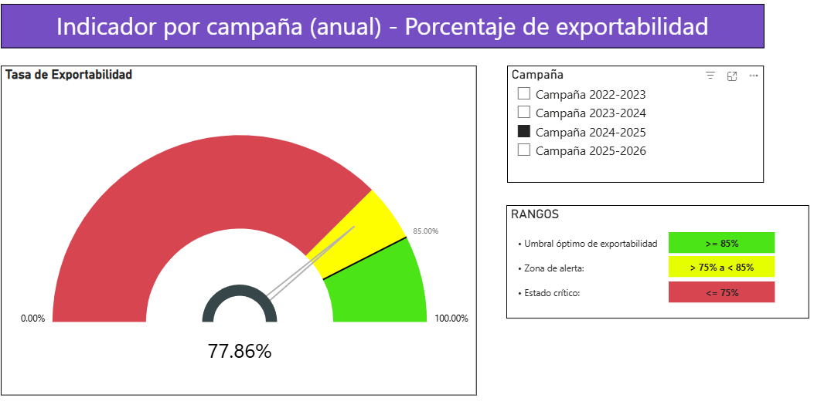

---

#### 📅 Campaña 2025-2026
Diagnóstico del estado actual del negocio (cierre con un 75% de exportabilidad).

  

---

### 3. Reporte Detallado (Operaciones y Proyección)
Esta sección analiza la evolución histórica del indicador de exportabilidad, diagnosticando la causa raíz del rendimiento actual y trazando la ruta financiera para alcanzar la meta proyectada.

  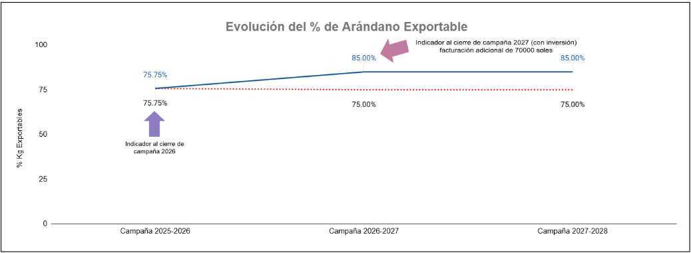

> ### 🔍 Diagnóstico Estratégico (Metodología WHAT / SO WHAT / NOW WHAT)
>
> **WHAT (¿Qué ocurrió?)**  
> Al inicio de la campaña 2026, **Berry-Data** registró un **75%** de arándano exportable, equivalente a **75,000 kg** de los **100,000 kg** producidos. El **25%** restante fue destinado a mercados de menor valor, reduciendo la rentabilidad y generando una facturación aproximada de **S/ 1,025,000**. Por lo tanto, el *Indicador Anual de Arándanos Exportables* por campaña se sitúa un **10% por debajo de lo esperado**.
> 
> ---
> 
> **SO WHAT (¿Qué impacto genera?)**  
> El bajo nivel de exportabilidad genera pérdidas económicas directas, ya que la fruta no exportable reduce su valor de **S/ 12 a S/ 5 por kg**. La empresa deja de percibir cerca de **S/ 70,000 anuales** debido a deficiencias en la selección, manejo y conservación postcosecha, afectando su competitividad y eficiencia operativa.
> 
> ---
> 
> **NOW WHAT (¿Qué acciones tomaremos?)**  
> **Berry-Data** busca elevar la exportabilidad al **85%** mediante:
> *   Capacitación al personal en selección y clasificación de fruta.
> *   Estandarización de criterios de calidad exportable.
> *   Optimización del manejo y conservación de fruta.
> *   Seguimiento operativo mediante indicadores de calidad.
> 
> *Con ello, se proyecta aumentar la facturación anual a **S/ 1,095,000** y generar una **ganancia adicional de S/ 50,000** tras una inversión única de **S/ 20,000**.*

---

## 💡 Sección de Asesoría: Resolución de Preguntas Clave

En esta sección se presentan los diagnósticos analíticos y visuales que dan respuesta a los 10 requerimientos estratégicos planteados por la gerencia de **BerryData**. Cada captura integra la visualización interactiva desarrollada en Power BI junto con su respectivo hallazgo de negocio:

### ❓ Pregunta 1

  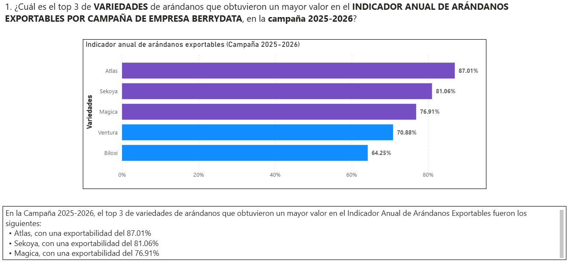

---

### ❓ Pregunta 2

  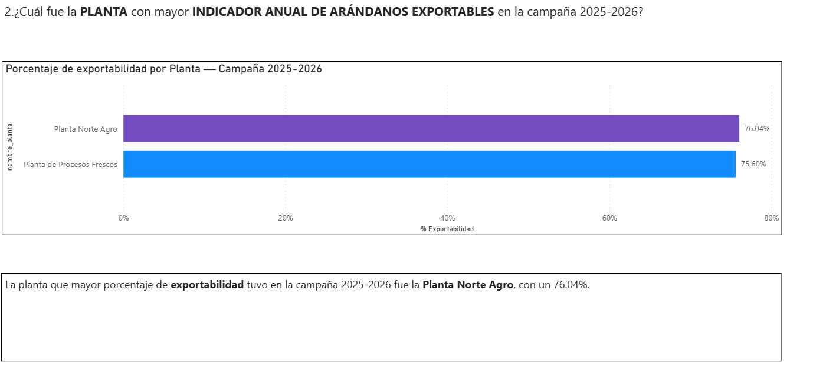

---

### ❓ Pregunta 3

  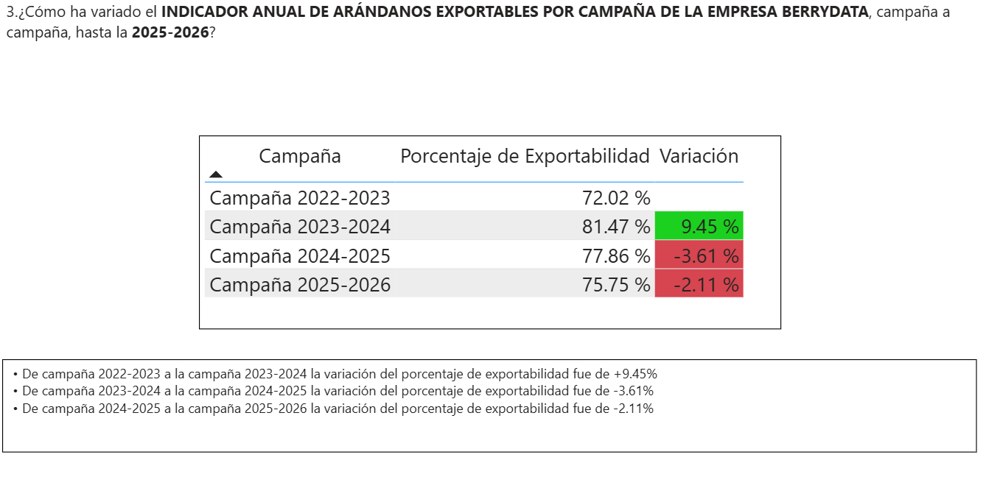

---

### ❓ Pregunta 4

  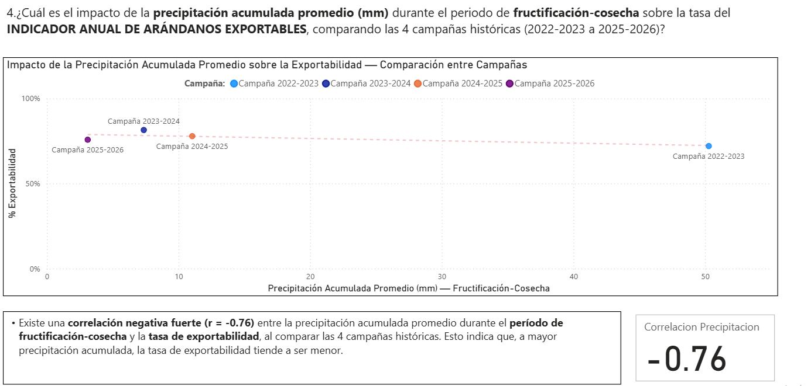

---

### ❓ Pregunta 5

  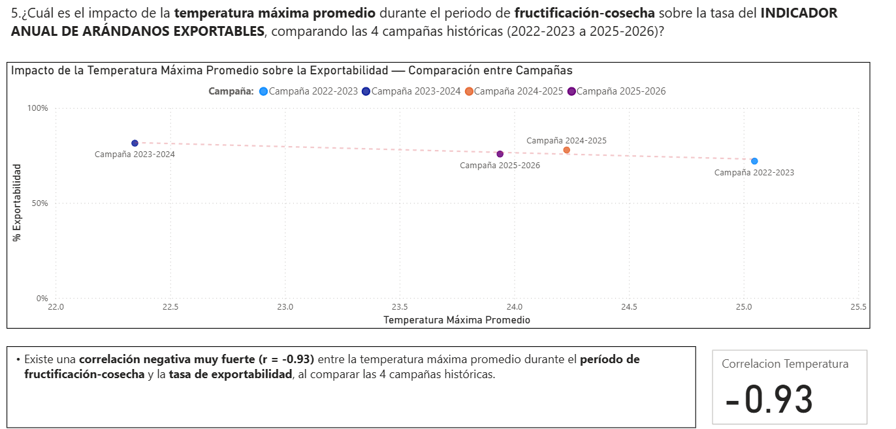

---

### ❓ Pregunta 6

  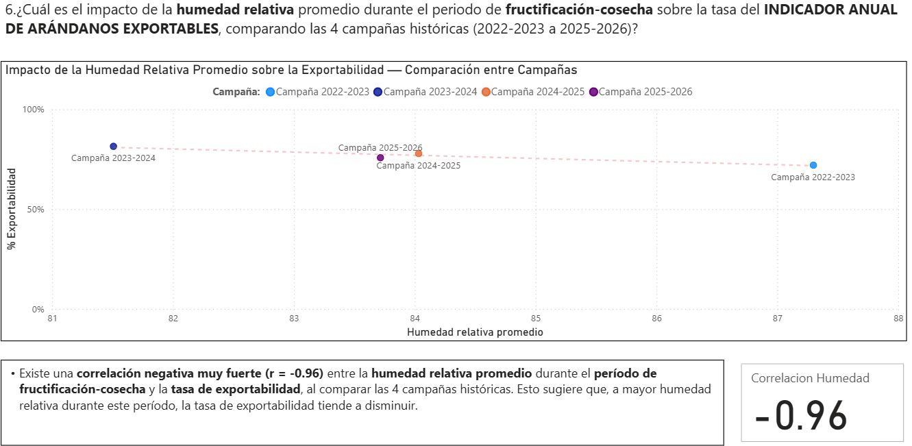

---

### ❓ Pregunta 7

  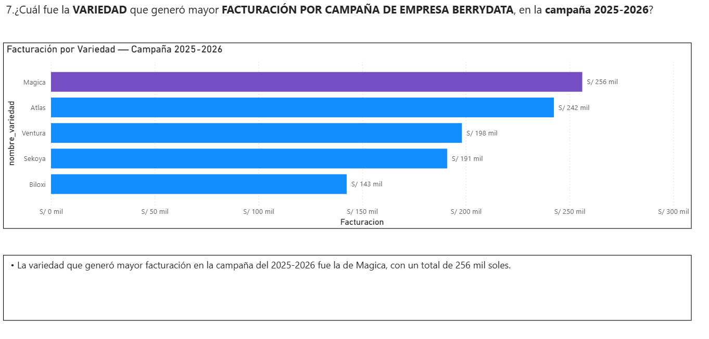

---

### ❓ Pregunta 8

  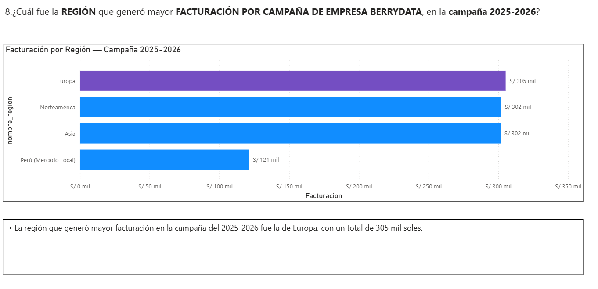

---

### ❓ Pregunta 9

  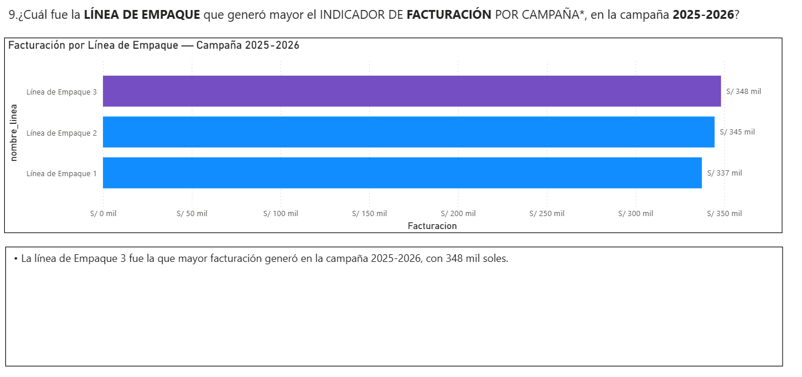

---

### ❓ Pregunta 10

  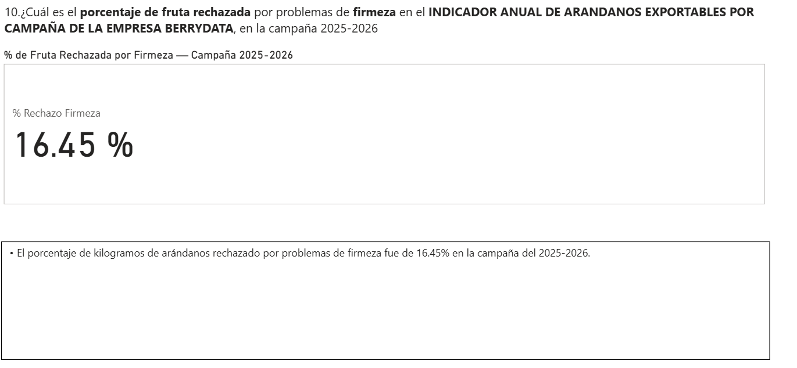

---

## 📌 Conclusión
El desarrollo de **BerryData** demuestra cómo una solución de Business Intelligence puede transformar datos operativos en información estratégica para la toma de decisiones. Mediante el uso de Power BI, un modelo de datos relacional y dashboards interactivos, fue posible identificar los principales factores que afectan el porcentaje de arándanos exportables y establecer acciones orientadas a incrementar este indicador del **75% al 85%**. 

Esta propuesta no solo facilita el monitoreo continuo del desempeño por campaña, región y variedad, sino que también permite anticipar oportunidades de mejora que impactan directamente en la rentabilidad y competitividad de la empresa agroexportadora.

---

## 💡 Valor Estratégico
**BerryData** aporta valor estratégico al convertir la información productiva y de calidad en un sistema de apoyo para la toma de decisiones basada en datos. La plataforma permite:

*   **Monitoreo continuo:** Seguimiento en tiempo real de los principales indicadores del proceso productivo.
*   **Detección temprana:** Identificación oportuna de desviaciones que afectan la calidad y exportabilidad de la fruta.
*   **Priorización con evidencia:** Focalización de acciones de mejora en postcosecha, manejo y clasificación de acuerdo con datos objetivos.
*   **Eficiencia y Rentabilidad:** Maximización del volumen de fruta exportable, generando un impacto económico positivo y un mejor aprovechamiento de la producción.
*   **Cultura Data-Driven:** Promoción de una cultura organizacional orientada al análisis de datos y la mejora continua, fortaleciendo la competitividad de la empresa en el mercado agroexportador.

---

## 🛠️ Herramientas Utilizadas
*   **SQL:** Query de carga, transformación e inserción de datos hacia el modelo relacional.
*   **Microsoft Power BI:** Modelado de datos (DAX), ETL (Power Query) y diseño de la interfaz interactiva.
*   **Microsoft Excel:** Procesamiento inicial y almacenamiento de las bases de datos origen.
*   **GitHub Pages:** Despliegue estático y presentación del portafolio del proyecto.

---

## 👥 Integrantes (Grupo 3)
*   Jairo Corimanya Seminario
*   Aarón Luque Cherres
*   Fabiola Vallejos
*   Rodrigo Lovera

---

## 🚀 ¿Cómo visualizar el proyecto?
> [!TIP]
> Puedes interactuar directamente con la presentación y los resultados de este proyecto visitando nuestra **https://rlobo911.github.io/Grupo03PUCP-BerryData/**.
